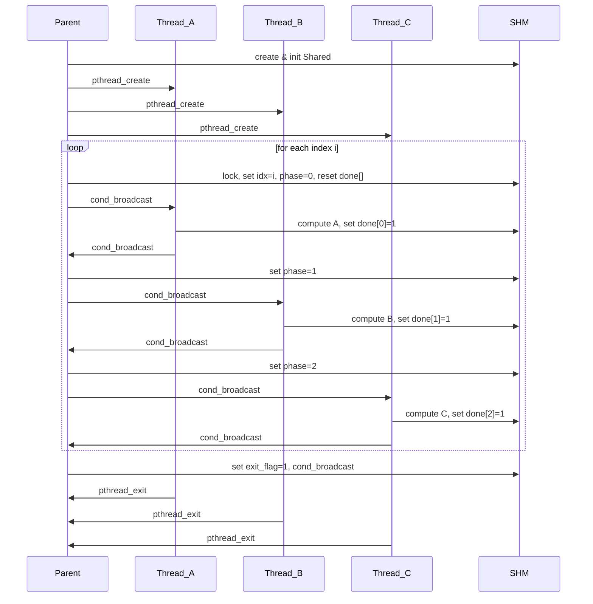

# A2_06_05 — Architecture, Memory Layout & Flowchart

This document describes the architecture, data structures, memory layout and the flowchart (Mermaid + ASCII fallback) for `question.c` (Assignment 5 — Threads, Synchronization & System V shared memory).

## Architecture overview

- Language: C
- Concurrency: POSIX threads (`pthread_create`, `pthread_join`, `pthread_mutex_t`, `pthread_cond_t`).
- IPC: System V shared memory (`shmget`, `shmat`, `shmdt`, `shmctl`).
- Execution model: Single process (parent) creates three worker threads that operate on a shared memory region within the same process address space.

## Key data structures

From `question.c`:

- `typedef struct { int x, y, a, b; float c; } Pair;`
  - Holds the input pair and computed results for one index.

- `typedef struct { Pair pairs[MAX_PAIRS]; int n; int idx; int phase; int done[3]; int exit_flag; pthread_mutex_t mutex; pthread_cond_t cond; } Shared;`
  - `pairs[]`: array to store up to `MAX_PAIRS` pairs and their results.
  - `n`: total number of pairs used.
  - `idx`: the index currently being processed by the workers.
  - `phase`: the current phase (0 -> compute A, 1 -> compute B, 2 -> compute C).
  - `done[]`: per-phase completion flags set by workers (done[0], done[1], done[2]).
  - `exit_flag`: signal for worker threads to break their processing loops.
  - `mutex`, `cond`: synchronization primitives placed in shared memory.

## Memory layout

- A single System V shared memory segment contains one `Shared` instance.
- Layout (conceptual):
  - bytes: | pairs[0] | pairs[1] | ... | pairs[MAX_PAIRS-1] | n | idx | phase | done[3] | exit_flag | mutex | cond |
- Each `Pair` is compact (four ints + float). On a typical 64-bit machine `int` is 4 bytes and `float` 4 bytes; `Pair` size ≈ 20 bytes (aligned to struct padding), and `Shared` size depends on padding and sync primitive sizes.

## Thread interaction & sequence

- Parent initializes shared memory and synchronization primitives.
- Parent creates threads `ta`, `tb`, `tc` for computing A, B, C respectively.
- For each index `i`:
  - Parent: locks mutex -> sets `idx=i`, `phase=0`, resets `done[]` -> `pthread_cond_broadcast` -> waits until `done[0]`.
  - Thread A: wakes up when `phase==0`, computes `A=X*Y`, sets `done[0]=1`, broadcasts cond.
  - Parent: upon seeing `done[0]`, sets `phase=1`, broadcasts cond, waits for `done[1]`.
  - Thread B: wakes when `phase==1`, computes `B=2*X+2*Y+1`, sets `done[1]=1`, broadcasts cond.
  - Parent: sets `phase=2`, broadcasts cond, waits for `done[2]`.
  - Thread C: wakes when `phase==2`, computes `C=B/A` (handles A==0), sets `done[2]=1`, broadcasts cond.
  - Parent: unlocks and moves to next index.
- After last index, parent sets `exit_flag=1`, broadcasts cond so each thread can break and exit.

## Flowchart (Mermaid)

## ASCII fallback flow

Parent: create shared memory -> init shared struct -> create threads A,B,C
for i = 0..n-1:
  lock mutex
  set idx=i, phase=0, reset done[]
  broadcast cond
  wait(done[0])
  set phase=1
  broadcast cond
  wait(done[1])
  set phase=2
  broadcast cond
  wait(done[2])
  unlock mutex
end
set exit_flag, broadcast cond, join threads, print results, sleep 10s, cleanup

## Robustness considerations

- Error checking: Check return values from `shmget`, `shmat`, `pthread_create`, `pthread_join`, `pthread_mutex_init`, `pthread_cond_init` and `malloc` if any.
- Shared memory key: using a fixed key (1234) can collide. Prefer `ftok("path", proj_id)` or `IPC_PRIVATE` depending on usecase.
- Synchronization attributes: for inter-process use set `pthread_mutexattr_setpshared(&attr, PTHREAD_PROCESS_SHARED)` before initializing the mutex and cond (not required for threads in same process).
- Spurious wakeups: `pthread_cond_wait` can return spuriously. Code already uses `while (sh->phase != X && !sh->exit_flag) pthread_cond_wait(...)` which is safe.
- Ownership of init & destroy: ensure only the process that initialized the sync primitives destroys them; if multiple processes may attach, implement a leader election for init/cleanup.

## Security & permissions

- The segment is created with permissions `0666` — any user on the system may attach if they know the key and the segment exists. For lab use, this is acceptable but for security-sensitive scenarios use tighter permissions.

## Files for maintainers

- `question.c` — main program. Contains top comment block with team members and sample run instructions.

---

If you want I can also:
- Patch `question.c` to use `ftok` instead of a fixed key, and add error checking around pthread and shm calls.
- Add a tiny unit-test/runner that runs `./a.out 5`, captures `ipcs -m`, and verifies cleanup.

Tell me which patch you'd like (or say "done" to finish).