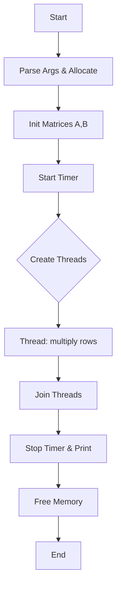

# A2_06_06 — Architecture, Memory Layout & Flowchart

This file documents the architecture decisions, memory layout, threading model and includes a Mermaid flowchart (plus ASCII fallback) for `A2_06_06.c` (parallel matrix multiplication).

## Architecture overview

- Language: C with POSIX threads (pthread).
- Data structures:
  - Matrices A, B, C stored as `unsigned char**` (array of row pointers). Each row is an `unsigned char*` of length N.
  - `thread_data_t` struct holds thread ID, row range and pointers to matrices.
- Threading model:
  - Worker threads (T of them) created by `main` via `pthread_create`.
  - Each thread performs `multiply()` on the assigned rows only.
  - No locks are required because rows are disjoint (no shared writes).

## Memory layout and sizing

- For `N x N` matrices with `unsigned char` (1 byte per element):
  - Single matrix size ≈ N*N bytes.
  - Total for A,B,C ≈ 3*N*N bytes.
  - For N=3000: single matrix ≈ 9,000,000 bytes (~8.6 MB); total ≈ 25.8 MB.
- Row-wise allocation:
  - Current code uses `malloc(N * sizeof(unsigned char))` per row.
  - Alternative: allocate a single contiguous block `malloc(N*N)` and set row pointers into it for better performance and fewer allocations.

## Thread-data contract

- Inputs (read-only): pointers to A, B, matrix size N.
- Outputs (written by thread): assigned rows of C.
- Error modes: invalid `start_row/end_row` or `NULL` matrix pointers cause undefined behaviour; validate in `main`.

## Flowchart (Mermaid)

## ASCII fallback flow

Start -> Parse Args & Allocate -> Init Matrices -> Start Timer -> Create Threads -> Worker: multiply rows -> Join Threads -> Stop Timer -> Free -> End

## Notes for maintainers

- To improve performance, consider:
  - Switching to a contiguous 1D buffer for each matrix.
  - Loop tiling (blocking) to improve cache reuse.
  - Using `clock_gettime(CLOCK_MONOTONIC, ...)` for timing instead of `gettimeofday`.

- To improve robustness, consider:
  - Checking `malloc` return values.
  - Validating `mod_value >= 1`.
  - Adding a serial verification path for debugging.

---

If you want, I can make the code changes (seed RNG once, check malloc, add contiguous buffer) and run a quick compile test. Say "apply fixes" and I'll implement them and run the build.